# Architecture Technique - DamageControl AI

## 🏗 Vue Globale

L'application suit une architecture client-serveur avec traitement IA côté backend.

```mermaid
graph TD
    User[Utilisateur] -->|Upload Image| Frontend[Frontend Vue.js]
    Frontend -->|HTTP POST| Backend[Backend FastAPI]
    Backend -->|Stockage Local| Files[Système de Fichiers]
    Backend -->|Inférence| AI[Depth Anything Model]
    AI -->|Depth Map| Backend
    Backend -->|Résultats| Frontend
    Frontend -->|Affichage| User
```



## 🔧 Choix Technologiques & Justification

### 1. Frontend : Vue.js 3 + TailwindCSS

**Pourquoi Vue.js ?**

- Expérience préalable avec Vue.js
- Écosystème riche et moderne (Vite, Composition API)
- Excellente réactivité pour les interfaces dynamiques

**TailwindCSS :**

- Design rapide et moderne
- Utility-first pour un contrôle total
- Dark mode natif

**TresJS (✅ Implémenté) :**

- Équivalent de React-Three-Fiber pour Vue
- Visualisation 3D interactive des depth maps
- OrbitControls pour rotation/zoom/pan
- Displacement mapping pour relief 3D

### 2. Backend : Python FastAPI

**Pourquoi FastAPI ?**

- Standard de l'industrie pour servir des modèles IA
- Performance élevée (asynchrone)
- Documentation automatique (Swagger UI)
- Validation de données avec Pydantic

**Traitement d'images :**

- **OpenCV** : Normalisation et colormap des depth maps
- **PIL/Pillow** : Manipulation d'images
- **NumPy** : Calculs matriciels

### 3. Intelligence Artificielle (Hugging Face + Ultralytics)

**Modèles utilisés :**

#### Depth Anything (✅ Implémenté)

- **Modèle** : `LiheYoung/depth-anything-small-hf`
- **Tâche** : Estimation de profondeur monoculaire
- **Usage** : Génère une carte de profondeur 3D à partir d'une image 2D
- **Performance** : ~2-5 secondes par image (CPU)
- **Visualisation** : Colormap INFERNO (rouge = proche, bleu = loin)

#### YOLOv8 (✅ Implémenté)

- **Modèle** : `yolov8n.pt` (nano)
- **Tâche** : Détection d'objets génériques
- **Usage** : Identifier les objets dans l'image (voitures, personnes, camions)
- **Performance** : ~1-2 secondes par image (CPU)
- **Threshold** : 25% de confiance minimum

#### OWL-ViT (✅ Implémenté)

- **Modèle** : `google/owlvit-base-patch32`
- **Tâche** : Zero-Shot Object Detection
- **Usage** : Détecter des pièces spécifiques via requêtes textuelles (bumper, door, wheel, etc.)
- **Performance** : ~5-10 secondes par image (CPU)
- **Threshold** : 5% de confiance minimum
- **Avantage** : Pas besoin d'entraînement pour de nouvelles classes

#### TAPAS (Prévu - Sprint 3)

- **Modèle** : `google/tapas-base-finetuned-wtq`
- **Tâche** : Question-Answering sur tableaux
- **Usage** : Extraire franchises et garanties depuis des contrats PDF

### 4. Stockage : Système de Fichiers Local

**Pourquoi pas MinIO/S3 pour le MVP ?**

- Simplicité de développement
- Pas de dépendance Docker
- Suffisant pour la preuve de concept

**Structure actuelle :**

```
/backend/uploads/
├── [uuid].jpg                  # Image originale
├── depth_[uuid].jpg            # Depth map générée
├── detected_[uuid].jpg         # YOLO annotations
└── parts_[uuid].jpg            # OWL-ViT annotations
```

**Migration future :**

- Facile à migrer vers S3/MinIO en production
- Changement minimal du code (juste la configuration)

## 📊 Flux de Données

### 1. Upload d'Image

```
User → Frontend → POST /upload → Backend → Filesystem
                                         ↓
                                    Response (filename, url)
```

### 2. Analyse de Profondeur

```
User → Frontend → POST /analyze/{filename} → Backend
                                              ↓
                                         Load Image
                                              ↓
                                    Depth Anything Model
                                              ↓
                                    Generate Depth Map
                                              ↓
                                    Apply Colormap (OpenCV)
                                              ↓
                                    Save to Filesystem
                                              ↓
                                    Response (depth_map_url, stats)
                                              ↓
                                         Frontend
                                              ↓
                                    Display Side-by-Side
```

## 🔒 Sécurité & Limitations

### Sécurité actuelle :

- Validation du type de fichier (images uniquement)
- Noms de fichiers UUID (évite les collisions)
- CORS configuré pour localhost uniquement

### Limitations MVP :

- Pas d'authentification utilisateur
- Stockage local (non scalable)
- CPU uniquement (pas de GPU)
- Pas de limite de taille de fichier

### Améliorations futures :

- Authentification JWT
- Stockage cloud (S3)
- Support GPU pour accélération
- Rate limiting
- Compression d'images

## 📈 Performance

### Temps de traitement (CPU - Intel i7) :

- Upload : < 100ms
- Depth Estimation : 2-5 secondes
- Total (upload + analyse) : ~5 secondes

### Optimisations possibles :

- Utilisation GPU (CUDA) : 10x plus rapide
- Modèle quantifié : 2x plus rapide
- Batch processing : Traiter plusieurs images en parallèle

## 🚀 Évolution de l'Architecture

### Phase actuelle (MVP) :

- Monolithe simple
- Stockage local
- CPU uniquement

### Phase 2 (Production) :

- Séparation Frontend/Backend (déploiement indépendant)
- Stockage S3
- GPU pour l'inférence
- Cache Redis pour les résultats

### Phase 3 (Scale) :

- Microservices (service par modèle IA)
- Queue de traitement (Celery/RabbitMQ)
- Load balancing
- CDN pour les images
